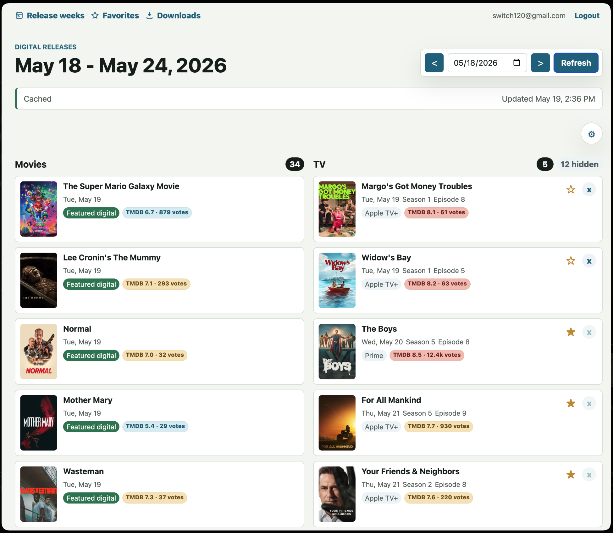
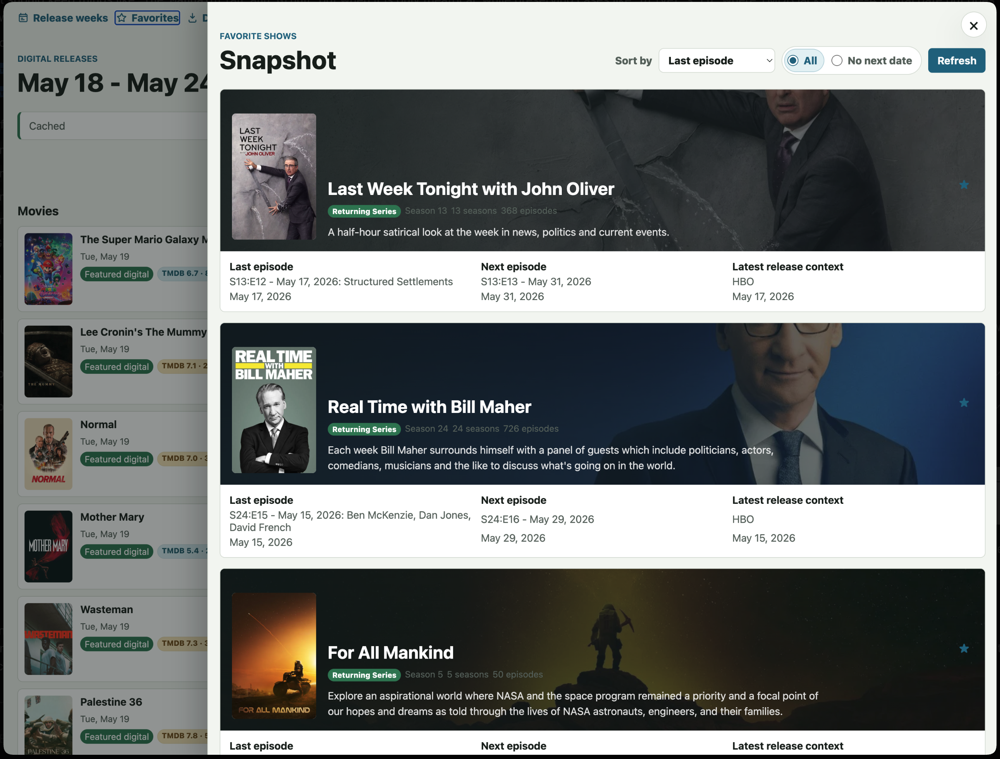
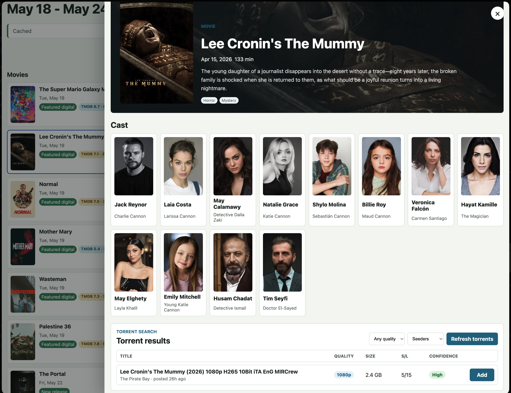
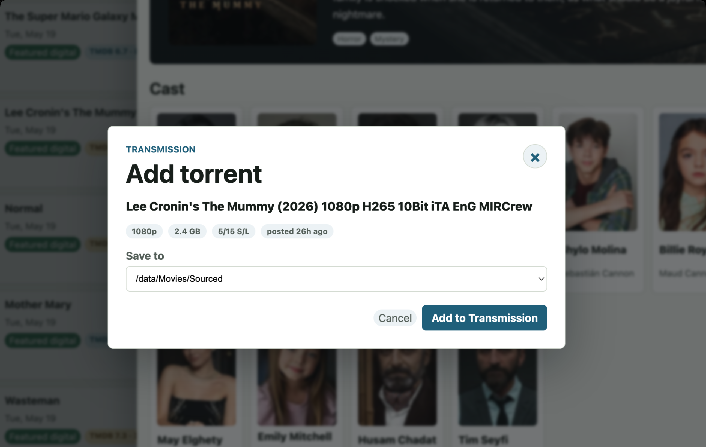
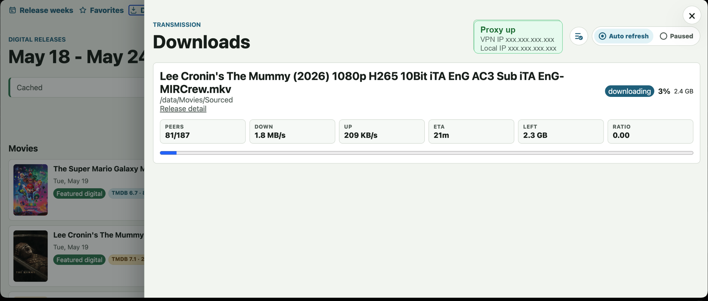

# Torrent Helper - Docker OpenVPN + Transmission

### Purpose
Run Transmission behind a VPN tunnel on Docker, with a local release hub that periodically removes completed torrents after they begin seeding.

### What it does
This project uses the [haugene/transmission-openvpn](https://hub.docker.com/r/haugene/transmission-openvpn/) image so Transmission only runs while OpenVPN has an active tunnel. The NestJS release API talks to Transmission over RPC for torrent add/status behavior and completed-torrent cleanup.

Transmission configuration persists in the `trans-config` volume mounted at `/config`, and downloads remain on the `trans-data` NFS-backed volume mounted at `/data`.

The release hub is an additive local web app. It runs a NestJS API, Angular UI, PostgreSQL cache, and optional Prowlarr integration in separate Docker services. TMDB is the primary source for movie digital dates, provider streaming context, TV episode airings, ratings, details, and favorite-show snapshots. DVDsReleaseDates supplements movie Digital HD weeks when TMDB misses a title.

### Getting Started
* Copy `.env.example` to `.env`.
* Add your VPN provider credentials and settings to `.env`.
* Add `TMDB_API_KEY` or `TMDB_READ_ACCESS_TOKEN` to `.env` for weekly movie and TV release data.
* Add Auth0 config to `.env` if you want the browser app to load protected release data.
* Add `PROWLARR_API_KEY` after configuring Prowlarr indexers if you want torrent search.
* Add `OPENAI_API_KEY` only if you want optional torrent result reranking, then set `OPENAI_TORRENT_RERANK_ENABLED=true`. Torrent titles and metadata are sent to OpenAI; magnet links are not sent.
* Confirm the `trans-data` NFS volume in `docker-compose.yml` points at the intended storage location.
* If you need extra haugene/OpenVPN environment variables, add them explicitly under `torrentHost.environment`; the VPN container does not receive the full `.env` file.
* Review the [haugene documentation](https://haugene.github.io/docker-transmission-openvpn/) before changing provider-specific VPN settings.

### How to use it

Start the VPN and Transmission container first:

```bash
docker compose up -d torrentHost
```

Start the release hub after `torrentHost` is healthy:

```bash
docker compose up -d releaseDb releaseApi releaseWeb
```

Or start the full stack:

```bash
docker compose up -d
```

Start only the release hub:

```bash
docker compose up -d releaseDb releaseApi releaseWeb
```

Open the release browser at `http://localhost:4200`. The API is available at `http://localhost:3001/api/health`. Compose binds published ports to `127.0.0.1` by default so the stack stays local to the host unless you intentionally change the mappings.

Stop the stack:

```bash
docker compose down
```

### Torrent Cleanup
While `releaseApi` is running, a NestJS cron checks Transmission every 30 seconds and removes any torrents that have completed and begun seeding. Local data is not deleted; this matches Transmission's `torrent-remove` behavior with `delete-local-data` disabled.

### Digital Release Hub
The release hub lets you choose a Monday-Sunday week and view cached digital releases grouped into Movies and TV. TMDB powers the primary weekly surface: original digital movie dates, provider streaming context, TV airings, details, ratings, language flags, and favorite-show snapshots. DVDsReleaseDates is used as a supplemental Digital HD schedule for movie weeks and is matched back to TMDB through IMDb IDs before rows are stored. The app stores release snapshots, normalized release rows, user settings, favorites, torrent searches, and download history in the local `release-db18` Postgres volume, not on the NFS-backed Transmission data volume.

<p>
  
</p>

Cache behavior:
* TMDB movie and TV weeks are cached separately and merged into the Movies and TV sections.
* Movie week refreshes may include DVDsReleaseDates supplemental Digital HD rows when TMDB misses an expected title.
* DVDsReleaseDates does not expose a digital-specific RSS/API feed, so the app fetches the public monthly Digital HD HTML page at refresh time and relies on the weekly cache to keep requests low-volume.
* TMDB digital movies with a recent primary release date plus a popularity or vote-count signal are ranked first and labeled `Featured digital`; older catalog/re-release rows stay lower or are excluded when they are not the original digital date.
* Weekly browsing is a read-time projection over cached release dates, not a separate copy of each upstream response.
* Cached past weeks are treated as permanent after they have been fetched once the week has completed.
* Current and future weeks refresh after 24 hours or when you click refresh.
* Any week can be manually refreshed.
* If TMDB fails and cached data exists, the API returns stale cached data with a warning.
* TMDB 429 and transient server errors are retried with backoff before surfacing a warning.

Provider filters:
* Use the gear on the week browser to manage show filters, selected TV providers, and hidden shows.
* Selected providers, hidden shows, show-only-favorites, and favorites are stored per Auth0 user in Postgres.
* The seeded provider list is Apple TV+, Netflix, Max, Disney+, Hulu, Prime, Paramount+, Peacock, HBO, and STARZ.

<p>
  
</p>

Torrent flow:
* Torrent searches use your configured Prowlarr/Torznab indexers only. The app does not scrape public torrent sites directly.
* Adding a torrent requires an explicit magnet selection and a `/data` download directory.
* Download history is stored per user so duplicate magnet links can be warned on later.
* OpenAI reranking is optional and disabled by default.

<p>
  
</p>

<p>
  
</p>

Useful development commands:

```bash
npm run precommit:check
npm run lint
npm run knip
npm run vpn-checker:add
npm --prefix apps/api test
npm --prefix apps/api run build
npm --prefix apps/web test
npm --prefix apps/web run build
```

If your host Node version is not supported by Prisma or Angular, run those commands through `node:22-alpine`, matching the Compose services.

### Pre-commit Checks
This repo uses a tracked `.githooks/pre-commit` hook. Running `npm install` at the repo root configures `core.hooksPath` to `.githooks`; you can also set it manually with:

```bash
git config core.hooksPath .githooks
```

The hook runs `npm run precommit:check`, which checks Knip, ESLint, and whitespace.

### Peer and VPN Diagnostics
PIA port forwarding can assign a dynamic peer port, so fixed `51413` host mappings are intentionally not published by default. Check the actual active port and tracker/peer status with:

```bash
npm run diagnose
```

The diagnostic script reports container health, `tun0` tunnel presence, Transmission's peer-port status, torrent peer counts, tracker errors, and recent VPN/port-forward log signals without printing `.env` or expanded Compose configuration.

### VPN Checker Torrent
The Downloads page can show a proxy-health card when Transmission contains the [WhatIsMyIP.net Torrent Tracker IP Checker](https://www.whatismyip.net/tools/torrent-ip-checker/). The app hides that permanent checker from the torrent list and compares its reported VPN IP with the host public IP.

<p>
  
</p>

To add the checker:

```bash
docker compose up -d torrentHost
npm run vpn-checker:add
```

This adds only the checker magnet to Transmission and stores it in Transmission's persistent config. It does not add trackers to your other downloads.

### Accessing Transmission WebUI
Once `torrentHost` is running and healthy, access the Transmission web interface at `http://localhost:9091/web`.

### Image Versions
The Compose file pins `haugene/transmission-openvpn:5.4.1` and pins Prowlarr by digest.
